# Modelo entidad-relación

Esquema completo: [`apps/api/prisma/schema.prisma`](../../apps/api/prisma/schema.prisma).
**44 modelos** organizados en ocho bloques.

---

## 1. Vista general

```mermaid
erDiagram
    Company ||--o{ CompanyContact : "tiene"
    Company ||--o{ Case : "múltiples casos"
    Company ||--o{ Document : "repositorio"
    CompanyContact |o--o| User : "es usuario"

    Role ||--o{ User : "rol"
    Role ||--o{ RolePermission : ""
    Permission ||--o{ RolePermission : ""
    User ||--o{ RefreshToken : "sesiones"

    User |o--|| Consultant : "perfil"
    Sponsor ||--o{ Consultant : "articula"
    Consultant ||--o{ ConsultantSpecialty : ""
    Consultant ||--|| ConsultantScope : "alcance"
    Consultant ||--o{ ConsultantStatusHistory : "ciclo de vida"

    Case ||--o{ CaseClassification : "T2 · historial"
    Case ||--o{ CaseStatusHistory : "recorrido"
    Case ||--o{ Application : "T3C"
    Case ||--o{ CaseAssignment : "responsable único"
    Case ||--|| Proposal : "expediente"
    Case ||--o{ CustomerDecision : "TP6A"
    Case ||--|| ContractChecklist : "T7A"
    Case ||--|| OperationalFramework : "T7B"
    Case ||--o{ Activity : "T8B"
    Case ||--o{ Milestone : "T8C"
    Case ||--o{ Incident : "T8D"
    Case ||--o{ Deliverable : "T8G"
    Case ||--|| ClosureChecklist : "T9C"
    Case ||--o{ SlaInstance : "relojes"
    Case ||--o{ AuditLog : "bitácora"

    Application ||--|| ApplicationEvaluation : "T3D"
    Application |o--|| CaseAssignment : "gana"
    Consultant ||--o{ Application : "postula"
    Consultant ||--o{ CaseAssignment : "asignado"

    Proposal ||--o{ ProposalVersion : "inmutables"
    ProposalVersion ||--o{ ProposalReview : "TP4H / peer"
    ProposalVersion ||--o{ ProposalAdjustment : "TP6B/TP6C"

    Document ||--o{ DocumentVersion : "nunca se sobrescribe"
    Deliverable ||--o{ DeliverableVersion : "versionado obligatorio"
    DeliverableVersion |o--o| DocumentVersion : "archivo"

    SlaRule ||--o{ SlaInstance : "resuelta por especificidad"
    SlaInstance ||--o{ SlaAlert : ""
    SlaInstance ||--o{ SlaEscalation : ""

    NotificationTemplate ||--o{ Notification : "TCOM"
    User ||--o{ Notification : "destinatario"

    LookupList ||--o{ LookupValue : "LOV"
```



---

## 2. Bloques del modelo

### Gobierno de plataforma
`LookupList`, `LookupValue`, `CaseStatus`, `ChecklistTemplate`,
`ChecklistTemplateItem`, `SlaRule`, `NotificationTemplate`, `CodeSequence`.

Todo lo parametrizable vive aquí. Cambiar una etiqueta, un ítem de checklist o
una duración de SLA es editar una fila, no desplegar.

### Identidad y RBAC
`Role`, `Permission`, `RolePermission`, `User`, `RefreshToken`.

### Empresa única
`Company`, `CompanyContact`.

`normalizedName` guarda el nombre sin tildes, sin puntuación y sin sufijo
societario; sobre esa columna corre el índice GIN de trigramas que hace posible
el matching. `emailDomain` es `NULL` para dominios genéricos, porque
`@gmail.com` no identifica a ninguna organización.

### Ecosistema de consultores
`Sponsor`, `Consultant`, `ConsultantSpecialty`, `ConsultantScope`,
`ConsultantStatusHistory`.

`ConsultantScope` es lo que hace operativa la elegibilidad: tipos de intervención,
sectores y si puede ser responsable principal, apoyo o revisor.

### Caso y workflow
`Case`, `CaseClassification`, `CaseStatusHistory`.

### Bolsa y asignación
`Application`, `ApplicationEvaluation`, `CaseAssignment`.

### Propuesta
`Proposal`, `ProposalVersion`, `ProposalReview`, `ProposalAdjustment`,
`CustomerDecision`.

### Contratación, ejecución y cierre
`ContractChecklist`, `ContractChecklistItem`, `ContractEvidence`,
`OperationalFramework`, `Activity`, `Milestone`, `Incident`, `Deliverable`,
`DeliverableVersion`, `Meeting`, `Communication`, `AdvisoryReview`,
`ClosureDeclaration`, `ClosureChecklist`, `ClosureChecklistItem`,
`CustomerClosureResponse`, `CustomerEvaluation`, `ConsultantEvaluation`.

### Transversales
`Document`, `DocumentVersion`, `DocumentAccess`, `SlaInstance`, `SlaAlert`,
`SlaEscalation`, `Notification`, `AuditLog`.

---

## 3. Decisiones de modelado que merecen explicación

### Por qué el estado del caso es un `enum` y además una tabla

`Case.status` es un enum de Prisma; `CaseStatus` es una tabla de metadatos
(etiqueta, orden, color, terminalidad).

Cada estado necesita **aristas declaradas en código** para existir de verdad: un
estado sin transiciones que entren o salgan no es un estado, es una fila
inalcanzable. Por eso la máquina de estados es código y el enum garantiza su
integridad referencial. Lo que sí es administrable sin desplegar —cómo se llama,
en qué orden aparece, de qué color— vive en la tabla.

### Por qué la clasificación está denormalizada en `Case`

`CaseClassification` es la fuente y guarda todo el historial (append-only:
reclasificar inserta una fila y marca la anterior `isCurrent = false`).

Pero filtrar la bolsa interna por área y complejidad, o agrupar el dashboard por
clasificación, exigiría un join a una tabla con historial en cada consulta. Los
seis campos vigentes se copian en `Case` en el momento de confirmar la
clasificación. La copia tiene un único escritor —el efecto de la transición
`CLASSIFY`— y eso es lo que la mantiene coherente.

### Por qué `hoursInPreviousStatus` se materializa

Sin ese campo, calcular el tiempo medio por etapa obliga a leer todo el historial
y restar pares de filas consecutivas en la aplicación. Con él, es un `AVG` sobre
un índice. Se calcula en el momento de la transición, cuando el dato ya está a
mano.

### Por qué no existen `Contract`, `Invoice` ni `Payment`

Porque **NODUS no es parte contractual**. La relación contractual es Mipyme ↔
consultor y se formaliza fuera de la plataforma. Lo que el modelo representa es
la veeduría: `ContractChecklist` (el proceso), `ContractEvidence` (el soporte,
sin asumir su contenido legal) y `OperationalFramework` (la base de seguimiento).

Si mañana se definiera una modalidad en la que NODUS sí contrata, serían
entidades nuevas — no una modificación de éstas.

---

## 4. Índices

### Definidos en el esquema

| Tabla | Índice | Consulta |
|---|---|---|
| `users` | `email` (único), `roleId`, `companyId`, `status` | login, alcance |
| `companies` | `taxId` (único), `emailDomain`, `normalizedName`, `createdAt` | matching |
| `company_contacts` | `(companyId, email)` único, `email`, `(companyId, isPrimary)` | matching, contacto principal |
| `consultants` | `code` / `identityDocument` únicos, `status`, `(status, maxComplexityCode)`, `sponsorId`, `tier` | consultor único, elegibilidad |
| `cases` | `companyId`, `status`, `createdAt`, `(status, createdAt)`, `(companyId, status)`, `(status, areaCode, complexityCode)` | tablero, «mis casos», bolsa |
| `case_status_history` | `(caseId, createdAt)`, `(newStatus, createdAt)` | timeline, KPIs de ciclo |
| `applications` | `(caseId, consultantId)` único, `caseId`, `consultantId`, `(caseId, status)` | una postulación por consultor y caso |
| `case_assignments` | `(caseId, isActive)`, `(consultantId, isActive)` | responsable vigente |
| `proposal_versions` | `(proposalId, versionNumber)` único, `(proposalId, status)` | versionado |
| `documents` | `caseId`, `companyId`, `(caseId, stage)` | repositorio por etapa |
| `document_versions` | `storageKey` único, `(documentId, versionNumber)` único | no sobrescritura |
| `sla_instances` | `caseId`, `status`, `(status, deadline)`, `(caseId, stage, status)` | barrido del worker |
| `sla_alerts` | `(instanceId, kind)` único | idempotencia de alertas |
| `notifications` | `recipientId`, `(recipientId, status, createdAt)`, `caseId`, `(status, createdAt)` | campanita |
| `audit_logs` | `(caseId, createdAt)`, `(companyId, createdAt)`, `(actorId, createdAt)`, `(action, createdAt)`, `createdAt`, `(entity, entityId)` | los cinco filtros de §26 |
| `milestones` | `(caseId, status)`, `(status, targetDate)` | barrido de vencidos |

### Definidos en la migración 002 (SQL)

Prisma no los expresa de forma declarativa.

**Índices únicos parciales — invariantes de negocio**

```sql
case_assignments_one_active_primary   UNIQUE (caseId) WHERE isPrimary AND isActive
case_classifications_one_current      UNIQUE (caseId) WHERE isCurrent
company_contacts_one_primary          UNIQUE (companyId) WHERE isPrimary AND isActive
proposal_versions_one_draft           UNIQUE (proposalId) WHERE status = 'BORRADOR'
sla_instances_one_open_per_stage      UNIQUE (caseId, stage) WHERE status IN (abiertos)
```

**Índices GIN de trigramas**

```sql
companies_normalized_name_trgm   GIN (normalizedName gin_trgm_ops)
cases_title_trgm                 GIN (title gin_trgm_ops)
```

**Triggers de inmutabilidad**

```sql
audit_logs_no_update / audit_logs_no_delete
document_versions_no_update / document_versions_no_delete
proposal_versions_frozen_immutable
```

El último permite avanzar el estado y sellar marcas de tiempo de una versión
congelada, pero rechaza cualquier cambio de `analysis`, `content`,
`versionNumber` o `proposalId`.

---

## 5. Convenciones

- **Claves primarias**: UUID v4. Evitan enumeración y no filtran volumen de
  negocio.
- **Identificadores legibles**: `Company.code`, `Case.code`, `Consultant.code`,
  `Sponsor.code`, generados con `CodeSequence` mediante
  `UPDATE … RETURNING` dentro de la transacción — sin carreras y sin huecos por
  rollback.
- **Marcas de tiempo**: `createdAt` en todas las tablas; `updatedAt` en las
  mutables. Las append-only (`AuditLog`, `CaseStatusHistory`,
  `DocumentVersion`, `DeliverableVersion`) no tienen `updatedAt` a propósito: no
  se actualizan.
- **Borrado**: `onDelete: Cascade` desde el caso y la empresa hacia sus hijos. En
  la práctica no se borra nada; la cascada existe para que una limpieza
  administrativa deliberada sea consistente.
- **Enums de Prisma** para conjuntos cerrados que el código necesita conocer
  (estados, roles); **LOV en base de datos** para taxonomías administrables.
