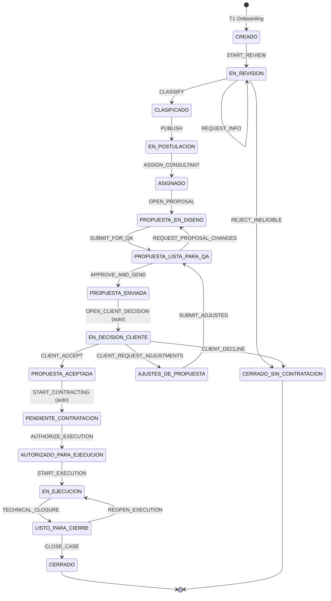

# Ciclo de vida del caso (Case Lifecycle)

El caso es la unidad de negocio de NODUS. Su estado es gobernado por una máquina de estados
implementada en `apps/api/src/modules/workflow`.

## 1. Estados

| # | Código | Etiqueta | Significado |
|---|---|---|---|
| 1 | `CREADO` | Creado | Necesidad registrada por la Mipyme (T1). Editable **solo** por el cliente y **solo** en este estado (RF-013). |
| 2 | `EN_REVISION` | En revisión | Advisory ejecuta debida diligencia. Puede solicitar ampliación de información. |
| 3 | `CLASIFICADO` | Clasificado | Caso elegible y clasificado con taxonomías LOV. Habilitado para bolsa. |
| 4 | `EN_POSTULACION` | En postulación | Publicado en bolsa interna; consultores elegibles pueden postularse. |
| 5 | `ASIGNADO` | Asignado | Existe un consultor responsable principal único. |
| 6 | `PROPUESTA_EN_DISENO` | Propuesta en diseño | Expediente de propuesta abierto; el consultor construye TP4B/TP4C. |
| 7 | `PROPUESTA_LISTA_PARA_QA` | Propuesta lista para QA | Versión consolidada esperando revisión metodológica (TP4H). |
| 8 | `PROPUESTA_ENVIADA` | Propuesta enviada | Advisory autorizó el envío; la propuesta está formalmente entregada. |
| 9 | `EN_DECISION_CLIENTE` | En decisión del cliente | Ventana formal de decisión abierta (TP6A). |
| 10 | `AJUSTES_DE_PROPUESTA` | Ajustes de propuesta | El cliente pidió cambios (TP6B); vuelve al consultor. |
| 11 | `PROPUESTA_ACEPTADA` | Propuesta aceptada | Aceptación formal registrada (TP6D). |
| 12 | `PENDIENTE_CONTRATACION` | Pendiente de contratación | Checklist T7A abierto; NODUS no es parte contractual. |
| 13 | `AUTORIZADO_PARA_EJECUCION` | Autorizado para ejecución | Checklist completo + marco operativo T7B cargado. |
| 14 | `EN_EJECUCION` | En ejecución | Agenda activa; actividades, hitos, incidencias y entregables en curso. |
| 15 | `LISTO_PARA_CIERRE` | Listo para cierre | Cierre técnico declarado por el consultor (T9A). |
| 16 | `CERRADO` | Cerrado | Cierre formal con aceptación del cliente y evaluaciones registradas. |
| 17 | `CERRADO_SIN_CONTRATACION` | Cerrado sin contratación | Terminal alternativo: no elegible, o el cliente no continúa (TP6E). |

Estados **terminales**: `CERRADO`, `CERRADO_SIN_CONTRATACION`.

## 2. Diagrama



## 3. Transiciones encadenadas automáticamente

Dos aristas están marcadas `auto: true`. El motor las ejecuta **dentro de la misma transacción** que
la transición que las dispara, generando su propia fila de `CaseStatusHistory` y su propio `AuditLog`
con `origin = SYSTEM`:

| Disparador | Encadena | Motivo documental |
|---|---|---|
| `APPROVE_AND_SEND` (→ `PROPUESTA_ENVIADA`) | `OPEN_CLIENT_DECISION` (→ `EN_DECISION_CLIENTE`) | «Una vez enviada y presentada la propuesta, la plataforma habilita el período formal de decisión» (Punto 6, act. 1). |
| `CLIENT_ACCEPT` (→ `PROPUESTA_ACEPTADA`) | `START_CONTRACTING` (→ `PENDIENTE_CONTRATACION`) | «El cambio de estado completo sería entonces: PROPUESTA ACEPTADA → PENDIENTE DE CONTRATACIÓN» (Punto 6, act. 4). |

Ambos estados intermedios **existen y quedan en el historial**: no se saltan, se atraviesan.

## 4. Quién puede mover el caso

El estado nunca se cambia desde el frontend. La única puerta es:

```
POST /cases/:id/transitions
{ "transition": "<CÓDIGO>", "payload": { ... }, "note": "opcional" }
```

El backend valida, en este orden: autenticación → permiso de rol → acceso al recurso → existencia de
la arista desde el estado actual → rol permitido en esa arista concreta → guards de negocio.
Un fallo en cualquier punto devuelve `403` o `409` y **no deja rastro de cambio** (sí queda registro
del intento rechazado en el log estructurado).

## 5. Sub-estados dentro de EN_EJECUCION

Siguiendo la recomendación del blueprint operativo (Punto 8: «sin crear demasiados estados globales,
controlar con subestados o atributos»), la ejecución no fragmenta el estado del caso. Se controla con
atributos calculados y expuestos en `GET /cases/:id/execution-summary`:

- agenda activada (≥1 `Milestone` o `Activity`)
- hitos en curso / vencidos
- incidencias abiertas / escaladas
- entregables por estado
- riesgo SLA agregado (`ON_TRACK` | `AT_RISK` | `OVERDUE`)

Esto deja libre la puerta a promover `EN_SEGUIMIENTO`, `EN_RIESGO`, `PENDIENTE_DE_CLIENTE` y
`LISTO_PARA_REVISION_FINAL` a estados globales en el futuro sin migrar datos históricos.
